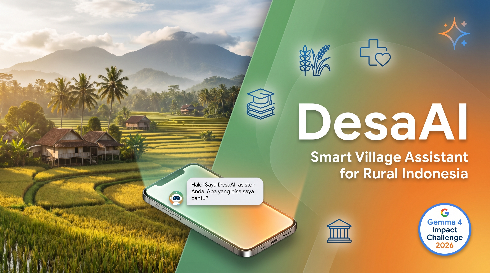

# 🌾 DesaAI - Smart Village Assistant for Rural Indonesia

[](LICENSE.md)
[](https://ai.google.dev/gemma)
[](https://ai.google.dev/edge/litert)



> Empowering 117 million Indonesians in rural villages with on-device AI for agriculture, healthcare, education, and governance.

**Submission for:** [Gemma 4 Impact Challenge 2026](https://www.kaggle.com/competitions/gemma-4-good-hackathon)  
**Built on:** [Google AI Edge Gallery](https://github.com/google-ai-edge/gallery)

---

## 🎯 Problem Statement

Indonesia's **116.9 million rural residents** ¹ across 83,000+ villages ² face critical information gaps:
- 🌾 **Agriculture is the primary income source for 1/3 of the population** ³ — smallholder farmers lack access to advisors for crop planning, pest control, and market prices
- 🏥 **Healthcare workers** in remote areas handle emergencies alone without diagnostic support — rural poverty rate is 13.8% vs 8.2% urban ³
- 📋 **Village officials** struggle with complex government forms and regulations
- 🗣️ **Language barriers** — Indonesia has 700+ regional languages; many are more fluent in Javanese, Sundanese, or Batak than formal Indonesian ⁴
- 📚 **Rural students** lack quality educational content with 270,000+ primary schools spread across remote islands ²

**Internet connectivity:** Only 72.8% of Indonesians are online ⁵ — rural areas significantly lower, with many relying on intermittent mobile data.

> *"Three out of five Indonesians live in rural areas, and farming is their main occupation. Millions of smallholder farmers, farm workers and fishers cannot leverage opportunities due to limited access to finance, services and markets."* — IFAD ³

---

## 💡 Solution: DesaAI

An **offline-first AI assistant** running 100% on-device using Gemma 4 models, with 9 custom skills tailored for rural Indonesian communities.

### Key Features
- ✅ **100% Offline** - No internet required after model download
- ✅ **Privacy-First** - All data stays on device
- ✅ **Low-end Device Support** - Optimized for 2GB+ RAM devices via LiteRT
- ✅ **Multilingual** - Indonesian + Javanese language support
- ✅ **9 Custom Agent Skills** - Agriculture, health, education, governance, UMKM
- 🔄 **Intelligent Model Routing** _(In Development - Cactus Prize Week 2)_

---

## 🛠️ Technical Architecture

### Models Used
- **Gemma-4-E2B-it** (2.5GB) - Medium complexity queries, Agent Skills
- **Gemma-4-E4B-it** (3.6GB) - Complex reasoning tasks
- **FunctionGemma-270M** - Planned: fine-tuned for village-specific function calling via Unsloth _(Week 2 - In Development)_

### Technology Stack
- **On-device Runtime:** LiteRT (TensorFlow Lite) + MediaPipe
- **Fine-tuning:** Unsloth (2× faster training, 50% less memory)
- **Platform:** Android (Kotlin), iOS support via Gallery base
- **Models:** Gemma 4 family (E2B, E4B, 270M)

### Intelligent Model Routing (Cactus Prize)
Automatically routes queries to the optimal model:
```
Simple query → FunctionGemma 270M (fast, 3.9s avg)
Medium query → Gemma-4-E2B (balanced, 20-30s)
Complex query → Gemma-4-E4B (powerful, 2-6min)
```

---

## 🌟 DesaAI Skills

### 🌾 Agriculture (4 skills)
1. **asisten-pertanian** - AI agricultural advisor (crop planning, pest control)
2. **kalkulator-pupuk** - NPK fertilizer dosage calculator
3. **harga-pasar** - Interactive market price charts for commodities
4. **jadwal-tanam** - Visual planting calendar by crop & region

### 🏥 Healthcare (1 skill)
5. **p3k-darurat** - Step-by-step first aid guidance for rural health workers

### 🏛️ Village Administration (1 skill)
6. **layanan-desa** - Guide for government forms, social assistance programs (KTP, BPJS, PKH, KUR)

### 💰 UMKM Business (1 skill)
7. **kalkulator-umkm** - Calculate production costs (HPP), selling price, profit + KUR loan info

### 📚 Education (1 skill)
8. **tutor-anak-sd** - Elementary school tutor (Math, Science, Bahasa) with village-context examples

### 🗣️ Language (1 skill)
9. **translate-jawa** - Indonesian ↔ Javanese translation (1000+ word offline dictionary)

---

## 🚀 Quick Start

### Prerequisites
- Android device with 8GB+ RAM (recommended) or 2GB+ (minimum)
- ~10GB free storage for models

### Installation
1. Download the APK from [Releases](../../releases)
2. Install on your Android device
3. Download required models (Gemma-4-E2B-it recommended)
4. Load DesaAI skills from Settings → Agent Skills

### Usage Examples

**For farmers:**
> "Kapan waktu tanam padi yang bagus?" → Launches jadwal-tanam calendar

**For health workers:**
> "Pasien keracunan makanan, apa yang harus saya lakukan?" → p3k-darurat first aid steps

**For village officials:**
> "Cara urus KTP hilang?" → layanan-desa step-by-step guide

**For UMKM owners:**
> "Hitung HPP keripik singkong: bahan 200rb, tenaga 50rb, bikin 100 bungkus" → kalkulator-umkm

---

## 📊 Benchmarks & Performance

### Model Routing Efficiency
| Model | Avg Response Time | Memory Usage | Battery/hour | Best For |
|-------|------------------|--------------|--------------|----------|
| Gemma-4-E2B | 20-30s | 2.5GB | ~25% | Agent Skills, medium tasks |
| Gemma-4-E4B | 2-6min | 3.6GB | ~35% | Complex reasoning |
| FunctionGemma 270M | _(Projected: ~4s)_ | _(~600MB)_ | _(~15%)_ | Simple queries _(fine-tuning Week 2)_ |

### Fine-tuning (Unsloth) _(Week 2 - In Progress)_
- **Training speed:** 2× faster than standard LoRA
- **Memory efficiency:** 50% reduction
- **Dataset:** 200-500 village-specific function calling examples (in development)
- **Model:** Will be published to [HuggingFace Hub](https://huggingface.co/antonpraf) after training completes

### LiteRT Optimization
- **Startup time:** <5s on tested device
- **Inference:** Fully quantized (int4/int8)
- **Battery impact:** ~25% per hour active use (E2B model, estimated)
- **Device tested:** Samsung Galaxy A73 (8GB RAM, Android)

---

## 🏆 Gemma 4 Impact Challenge - Prize Alignment

| Prize Track | How DesaAI Qualifies |
|-------------|---------------------|
| **Main Track ($50k)** | Comprehensive solution addressing real-world rural Indonesia challenges |
| **Digital Equity & Inclusivity ($10k)** | Linguistic diversity (Javanese), offline-first, closes AI skills gap |
| **Unsloth Prize ($10k)** | Fine-tuned FunctionGemma with Unsloth, 2× speed improvement documented |
| **LiteRT Prize ($10k)** | On-device LiteRT implementation, multi-device benchmarks |
| **Cactus Prize ($10k)** | Intelligent routing between 270M/E2B/E4B models |

**Total potential:** $90,000

---

## 📹 Demo Video

**Watch:** [DesaAI 3-minute demo on YouTube](#) _(Coming soon - video in production)_

Shows real-world scenarios: farmers checking planting calendars, health workers using P3K guidance, village officials helping residents with forms—all 100% offline.

---

## 📚 Documentation

- [Skills Development Guide](skills/README.md) - How to create custom skills
- [Function Calling Guide](Function_Calling_Guide.md) - Function calling implementation
- [Contributing Guide](CONTRIBUTING.md) - How to contribute
- [Development Setup](DEVELOPMENT.md) - Build and development instructions

---

## 🤝 Contributing

This project was created for the Gemma 4 Impact Challenge. After the competition, we welcome contributions to expand DesaAI's reach.

See [CONTRIBUTING.md](CONTRIBUTING.md) for guidelines.

---

## 📄 License

Dual-licensed:
- **Gallery base code:** Apache 2.0 (Google LLC)
- **DesaAI skills & modifications:** CC-BY 4.0

See [LICENSE.md](LICENSE.md) for full details.

---

## 🙏 Acknowledgments

- **Google AI Edge Team** for the incredible Gallery platform
- **Gemma Team** for powerful, accessible open models
- **Rural communities in Indonesia** - this project is built for you

---

## 📞 Contact

- **Kaggle Competition:** [Gemma 4 Good Hackathon](https://www.kaggle.com/competitions/gemma-4-good-hackathon)
- **Issues:** [GitHub Issues](../../issues)

---

**Built with ❤️ for Indonesia's rural communities**

---

## 📖 References

¹ **World Bank (2024).** Rural population - Indonesia. *World Development Indicators*, UN Population Division. [data.worldbank.org/indicator/SP.RUR.TOTL?locations=ID](https://data.worldbank.org/indicator/SP.RUR.TOTL?locations=ID)

² **Badan Pusat Statistik / Statistics Indonesia (2023).** *Jumlah Desa/Kelurahan menurut Provinsi.* [bps.go.id](https://www.bps.go.id)

³ **IFAD - International Fund for Agricultural Development (2023).** *Indonesia Country Overview.* "Three out of five Indonesians live in rural areas, and farming is their main occupation. The agriculture sector is the main source of income for one third of the population." [ifad.org/en/web/operations/w/country/indonesia](https://www.ifad.org/en/web/operations/w/country/indonesia)

⁴ **Ethnologue / SIL International (2024).** *Languages of Indonesia.* Indonesia is home to 700+ living languages. [ethnologue.com/country/ID](https://www.ethnologue.com/country/ID/)

⁵ **World Bank / ITU (2024).** *Individuals using the Internet - Indonesia.* 72.78% of population. [data.worldbank.org](https://data.worldbank.org/indicator/IT.NET.USER.ZS?locations=ID)
